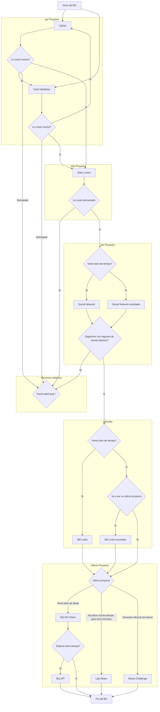

# Rutas de aprendizaje

```mermaid
  flowchart TD
    Ini[Inicio del BC] --> Cip[Cipher] & Car[Card Validation]

    subgraph Recursos externos
      FCCIni{FreeCodeCamp *}
    end
    
    subgraph 1er Proyecto
      Cip ---> CipBranch{Le costó mucho?} --Si--> Car
      Car ---> CarBranch{Le costó mucho?} --Si--> Cip
      CipBranch --Demasiado--> FCCIni
      CarBranch --Demasiado--> FCCIni
    end

    subgraph 2do Proyecto
      CipBranch & CarBranch --No--> Dat[Data Lovers]
      Dat --> DatBranch{Le costó demasiado}
      DatBranch --Si--> FCCIni
    end

    subgraph 3er Proyecto
      DatBranch --No--> SocBranch{Viene bien de tiempo?}
      SocBranch --Si--> Soc[Social Network]
      SocBranch --No--> SocV2[Social Network recortado]
      Soc & SocV2 --> SocBranch2{Seguimos con lagunas de temas básicos?}
      SocBranch2 --Si--> FCCIni
    end
    
    subgraph md-links
      SocBranch2 --No--> MdlBranch[MD Links]
      MdlBranch{Viene bien de tiempo?} --Si--> Mdl[MD Links]
      MdlBranch --No--> MdlBranch2{Va a ser su último proyecto} --No--> MdlV2[MD Links recortado]
    end

    subgraph Último Proyecto
      Mdl --> LastProjectBranch
      MdlBranch2 --Si--> LastProjectBranch
      MdlV2 ---> LastProjectBranch
      LastProjectBranch{Ultimo proyecto} --Viene bien de tiempo--> BQAC[BQ API Client]
      LastProjectBranch{Ultimo proyecto} --No tiene mucho tiempo pero hizo md-links --> Lab[Lab Notes]
      LastProjectBranch{Ultimo proyecto} --Necesita reforzar las bases--> Mov[Movie Challenge]
      BQAC --> BQACBranch{Todavía tiene tiempo?} --Si--> BQA[BQ API]
    end
    
    BQACBranch --No--> End[Fin del BC]
    Lab --> End
    Mov --> End
    BQA --> End
```
